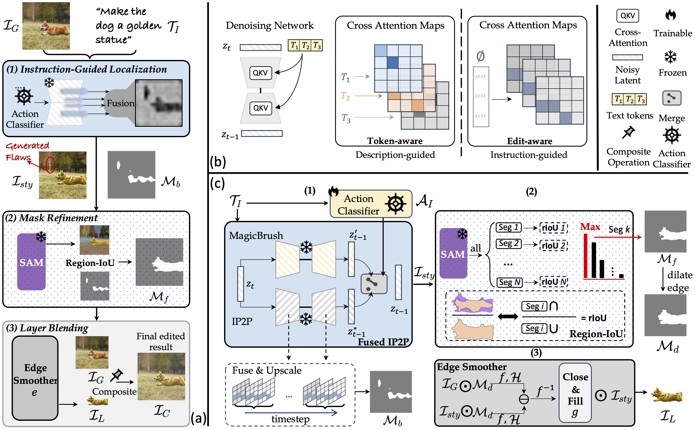

# ZONE: Zero-Shot Instruction-Guided Local Editing

[Arxiv Paper](https://arxiv.org/abs/2312.16794)


## Abstract

Recent advances in vision-language models like Stable Diffusion have shown remarkable power in creative image synthesis and editing. However, most existing text-to-image editing methods encounter two obstacles: First, the text prompt needs to be carefully crafted to achieve good results, which is not intuitive or user-friendly. Second, they are insensitive to local edits and can irreversibly affect non-edited regions, leaving obvious editing traces. To tackle these problems, we propose a Zero-shot instructiON-guided local image Editing approach, termed ZONE. We first convert the editing intent from the user-provided instruction (e.g., ``make his tie blue") into specific image editing regions through InstructPix2Pix. We then propose a Region-IoU scheme for precise image layer extraction from an off-the-shelf segment model. We further develop an edge smoother based on FFT for seamless blending between the layer and the image. Our method allows for arbitrary manipulation of a specific region with a single instruction while preserving the rest. Extensive experiments demonstrate that our ZONE achieves remarkable local editing results and user-friendliness, outperforming state-of-the-art methods.

## Framework



## TODO
- [x] 2024.04.12 release inference code and test set
- [ ] 2024.04.15-17 update arxiv with camera-ready version


## Dataset
We provide the test set used in our paper. We randomly select and annotate 100 samples for evaluation, including 60 real images from the Internet and 40 synthetic images. To ensure the representativeness of the evaluation, we consider the diversity of scenes and objects in the sample selection. In particular, we divide the test set into three categories: 32 images for `add`, 54 for `change`, and 14 for `remove` actions. All these 100 images are listed in the supplementary material. The test set can be downloaded from [Google Drive](https://drive.google.com/file/d/1lAwpENoDcO1QyFuwz3iKJJ7DmDTFMvIU/view?usp=sharing)

## Installation

### Requirements

- Linux with Python ≥ 3.6
- PyTorch == 1.10 and [torchvision](https://github.com/pytorch/vision/) that matches the PyTorch installation.
  Install them together at [pytorch.org](https://pytorch.org) to make sure of this. 

### Usage

Install required packages. 

```python
conda create --name zone python=3.8
conda activate zone
cd /path/to/code
pip install -r requirements.txt
```


Install Segment Anything (SAM):

```bash
pip install git+https://github.com/facebookresearch/segment-anything.git
```

or clone the repository locally and install with

```bash
git clone git@github.com:facebookresearch/segment-anything.git
cd segment-anything; pip install -e .
```

## Download pretrained models

Download ViT-H SAM model.

```bash
cd ckpts/
wget https://dl.fbaipublicfiles.com/segment_anything/sam_vit_h_4b8939.pth
```

Other models can be directly loaded from HuggingFace.

## Inference

```bash
python inference.py --instruction "make him a golden statue" --image_path "./data/dog.png"
python inference.py --instruction "wear her sunglasses" --image_path "./data/girl.png"
```

## Accknowledgements
We thank [Prompt-to-Prompt](https://github.com/google/prompt-to-prompt), [InstructPix2Pix](https://arxiv.org/abs/2211.09800) and [Segment Anything](https://github.com/facebookresearch/segment-anything) for their great work and inspiration.


## Citation
If you find this code/paper useful, please consider citing:

```bibtex
@article{li2023zone,
  title={Zone: Zero-shot instruction-guided local editing},
  author={Li, Shanglin and Zeng, Bohan and Feng, Yutang and Gao, Sicheng and Liu, Xuhui and Liu, Jiaming and Lin, Li and Tang, Xu and Hu, Yao and Liu, Jianzhuang and others},
  journal={arXiv preprint arXiv:2312.16794},
  year={2023}
}
```
